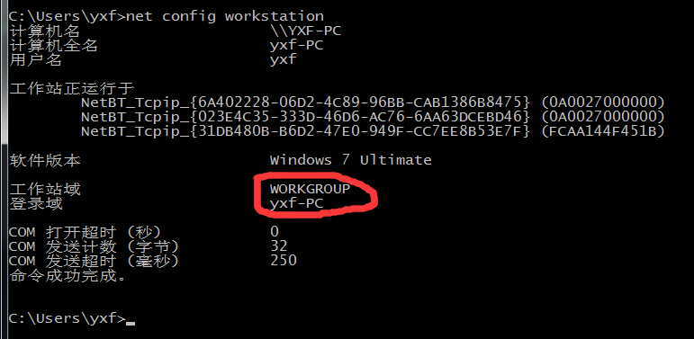

## Samba in centos7
### 初步说明  
我有个一新安装的CentOS7 服务器，这是我要安装Samba服务器的机子。当然，你需要有一个windows机器来检查这台CentOS7的服务器是可被连接的。
我的CentOS7的服务器主机名：wiself ，IP是：192.168.1.111
注意：Windows 机器必须和这台CentOS7在同一个工作组。可以用下面的命令来检查：
```
net config station
```

  
为了确保windows机器可以在窗口中处理类似的访问。在终端中添加服务器IP地址：  
```
notepad C:\Windows\System32\drivers\etc\hosts  
```
如下： 
```
[...]
192.168.1.111  wiself
```

### 安装及配置  
安装samba运行  
```
sudo yum install samba samba-client samba-common
```
配置如下：  
```
# vi /etc/samba/smb.conf
=================== Global Settings[全局选项] ==============================
[global]
workgroup = WORKGROUP                       ##设定Samba Server所要加入的工作组或域
server string = Samba Server Version %v     ##设定注释，宏%v表示显示Samba的版本号
netbios name = ployo                          ##设置Samba Server的NetBIOS名称
 
map to guest = bad user                     ##开启匿名访问
     
# ----------------- Logging Options [日志选项]-----------------------------
log file = /var/log/samba/log.%m            ##设置日志文件存储位置及名称，宏%m(主机名),表示对每台访问Samba Server的机器都单独记录一个日志文件
max log size = 50                           ##设置Samba Server日志文件的最大容量，单位为KB，0代表不限制
# ---------------- Standalone Server Options[独立运行进程] ---------------------
security = share                            ##共享级别:共享目录只能被授权的用户访问
passdb backend = tdbsam                     ##建立安全账户管理数据库
# ----------------- Printing Options[打印选项]-----------------------------
#        load printers = yes                ##设置是否在启动Samba时共享打印机
#        cups options = raw                 ##通用unix打印选项
#================== Share Definitions[共享参数] ==============================
  
[homes]                                     ##设置用户宿主目录
        comment = Home Directories          ##描述该共享:家目录
        browseable = no                     ##指定该共享是否可以浏览
        writable = yes                      ##指定该共享路径是否可写
[printers]                                  ##设置打印机宿主目录
        comment = All Printers              ##描述:所有打印机
        path = /var/spool/samba        
        browseable = no
        guest ok = no                       ##指定该共享是否允许guest账户访问
        writable = no
        printable = yes                     ##指定是否可打印
[public]
        comment = Public Stuff              ##定义说明信息
        path = /home/samba                  ##共享目录路径
        public = yes                        ##指定该共享是否允许guest账户访问
        writable = yes
        printable = no
        write list = +staff                 ##允许写入该共享的用户
```  
在修改完配置文件后，在配置文件的文件夹下可以使用命令testparm进行语法的测试验证。  
注：  
```
+ =====》 只在本机的密码文件组中查找
& =====》 只在nis服务中查找
@ =====》 先通过NIS服务器查找，nis找不到再到本机查找
```
启动：  
```
systemctl enable smb.service
systemctl enable nmb.service
systemctl restart smb.service
systemctl restart nmb.service
```
注：需要关闭centos的selinux与防火墙。  


### 访问  
Windows下，在命令提示行下输入：  
```
\\ployo
```
若要有使用的权限，在centos下，使用命令chmod对相应的文件及文件夹进行权限的修改即可。  
对建立好的网络位置还可进行驱动符的映射操作。  