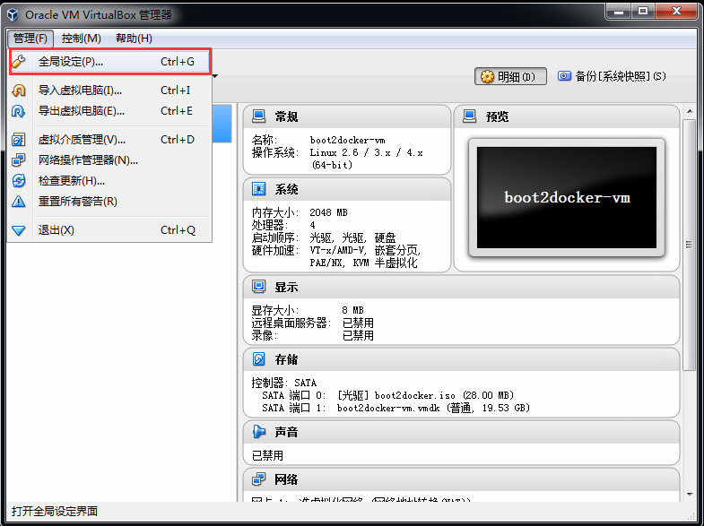
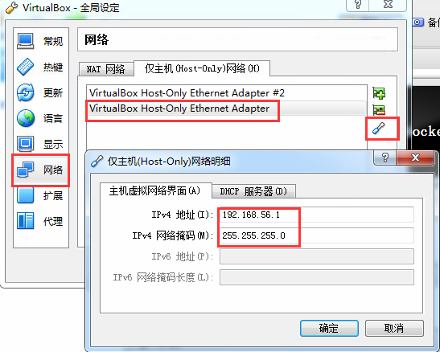
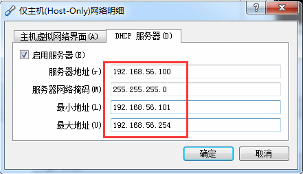
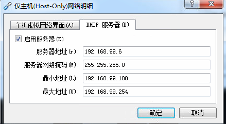

## Windows7安装Docker
### 下载  
官方文档：[https://docs.docker.com/engine/getstarted/step_one/](https://docs.docker.com/engine/getstarted/step_one/)  
ToolBox下载：[https://get.daocloud.io/toolbox/](https://get.daocloud.io/toolbox/)

### 安装  
点击下载的toolbox安装文件，一路点击next即可。  
安装完成后，桌面上应该有"Docker Quickstart Terminal"，"Oracle VM VirtualBox"，"Kitematic (Alpha)"的快捷方式。  

### 安装后配置  
#### Docker Quickstart Terminal  
点击Docker Quickstart Terminal，会做一些初始化的操作，确保初始化成功。  

#### VM VirtualBox网络设置  
点击桌面图标Oracle VM VirtualBox。  
  
docker安装之后默认的网络设置。  
  
  

#### 可以通过SSH来访问docker环境
  
